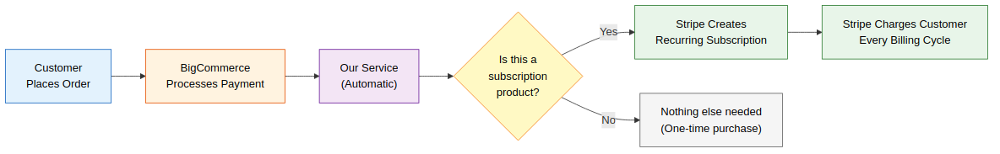
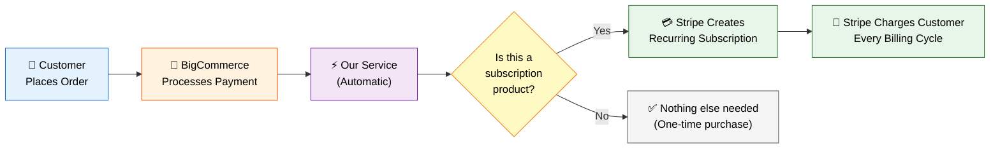
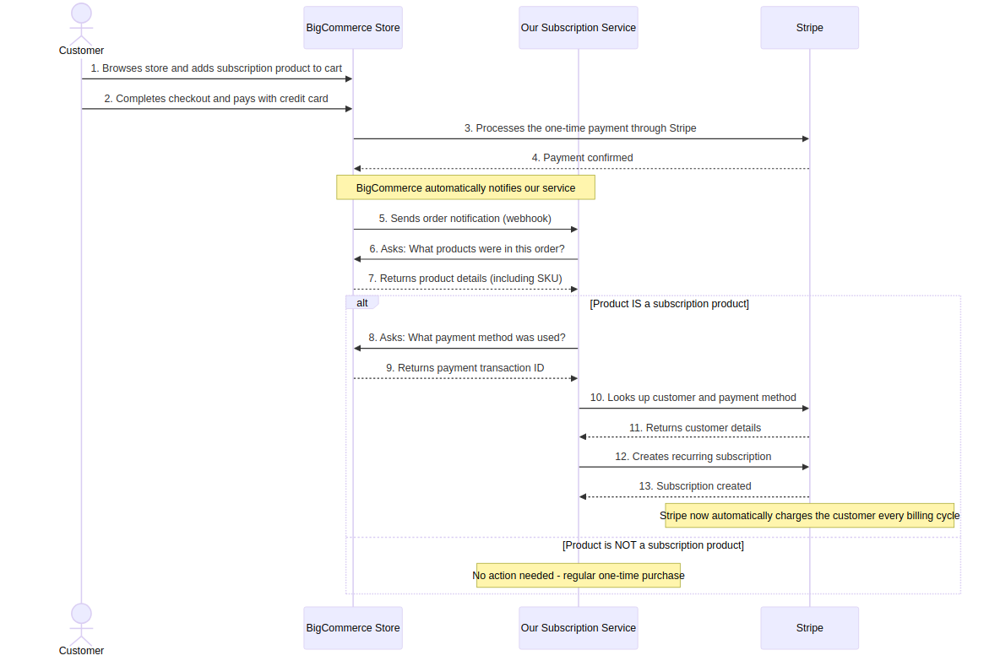
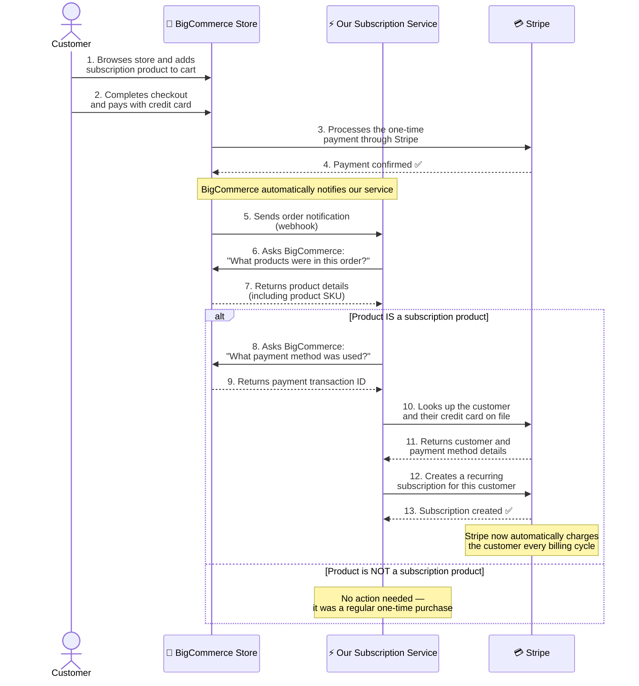

# How Stripe Subscriptions Work with BigCommerce

> **Audience:** Non-technical stakeholders, project managers, business owners
>
> This document explains how we handle recurring subscription billing for customers who purchase subscription products through a BigCommerce store.

---

## The Problem

BigCommerce supports Stripe as a payment provider for **one-time purchases**, but it **does not natively support Stripe subscriptions** (recurring billing). When a customer buys a subscription product, BigCommerce processes it as a regular one-time payment — it does not tell Stripe to charge the customer again next month.

## Our Solution

We built a small automated service that sits between BigCommerce and Stripe. Whenever a customer completes a purchase, this service automatically checks if the product is a subscription. If it is, the service sets up recurring billing in Stripe — so the customer is charged automatically each billing cycle without any manual work.

**No changes are needed to the BigCommerce storefront or checkout experience.** The customer shops and pays as usual. Everything happens behind the scenes.

---

## How It Works — The Big Picture

View interactive diagram (GitHub only)

---

## Step-by-Step Flow

The diagram below shows the exact sequence of events that happen when a customer places an order:

View interactive diagram (GitHub only)

---

## What Each System Does

| System | Role | Think of it as... |
|--------|------|-------------------|
| **BigCommerce** | The online store where customers browse and buy products | The storefront and cash register |
| **Our Subscription Service** | Automatically detects subscription purchases and sets up recurring billing | The behind-the-scenes assistant |
| **Stripe** | Processes payments and manages recurring subscriptions | The billing and payments department |

---

## Plain English Summary

Here is what happens in simple terms:

1. **A customer visits the BigCommerce store** and purchases a product that we have marked as a subscription (for example, a monthly coffee delivery or a software license).

2. **BigCommerce processes the payment** through Stripe, just like any normal purchase. The customer pays once and receives a confirmation.

3. **BigCommerce sends a notification** to our automated service saying "Hey, a new order was just placed."

4. **Our service checks the order** by asking BigCommerce what products were purchased. It looks at the product codes (SKUs) to determine if any of them are subscription products.

5. **If it finds a subscription product**, our service retrieves the payment details from the original transaction and tells Stripe: "This customer should be billed automatically every month (or whatever the billing cycle is) using the same payment method they just used."

6. **Stripe takes over from here.** It automatically charges the customer's credit card on each billing cycle, sends them invoices, and handles any payment issues — all without any manual intervention.

7. **If no subscription product is found** in the order, our service does nothing. It was just a regular one-time purchase.

---

## Key Benefits

- **Zero manual work** — Subscriptions are created automatically; no one needs to manually set up recurring billing for each customer.
- **Seamless customer experience** — The customer checks out normally on BigCommerce. They don't see anything different.
- **No changes to BigCommerce** — We don't modify the store, the checkout, or any BigCommerce settings. Our service works alongside the existing setup.
- **Stripe handles billing** — Once a subscription is created, Stripe manages all future charges, retries on failed payments, and invoice generation.
- **Configurable** — We can easily change which products are treated as subscriptions by updating a simple configuration setting.

---

## Frequently Asked Questions

**Q: Does the customer need to do anything different at checkout?**
No. The checkout experience is exactly the same. The subscription setup happens automatically after they pay.

**Q: What if a customer buys both a subscription product and a regular product in the same order?**
Our service only creates a subscription for the subscription product. The regular product is treated as a normal one-time purchase.

**Q: How does the customer manage their subscription (cancel, update payment, etc.)?**
Stripe provides a customer billing portal that can be embedded in the BigCommerce "My Account" page, allowing customers to manage their subscriptions self-service.

**Q: What happens if the automatic payment fails on the next billing cycle?**
Stripe has built-in retry logic and will attempt to charge the card multiple times. It also sends email notifications to the customer about failed payments.

**Q: Is this secure?**
Yes. All sensitive payment data is handled by Stripe — our service never stores credit card numbers. Communication between all systems uses encrypted connections (HTTPS).
